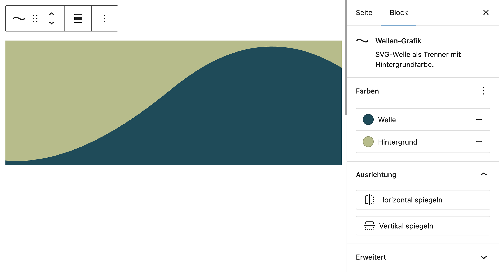

# UD Block: Wellen Grafik

Block zur Darstellung einer SVG-Wellenform als gestalterisches Trenner- oder Übergangselement zwischen Inhaltsbereichen.
Die Wellenform kann in Farbe, Ausrichtung und Position angepasst werden und ist sowohl im Editor als auch im Frontend sichtbar.

## Funktionen

- **Anpassbare Wellenform**
  - Auswahl der Wellenfarbe über Farbfeld im Editor
  - Steuerung von Position (oben oder unten) und Ausrichtung (normal oder gespiegelt)
  - Optional transparente oder flächige Darstellung

- **Einfache Integration**
  - Fügt sich als dekoratives Trenner-Element zwischen Blöcken ein
  - Kompatibel mit allen Standard-WordPress-Blöcken und Full Site Editing (FSE)

- **Editor-Integration**
  - Echtzeit-Vorschau der gewählten Farbe und Ausrichtung
  - Keine statischen Werte: Änderungen werden direkt im Editor sichtbar

## Screenshots

### Editor-Ansicht

*Wellen-Block im Editor mit Farbauswahl und Ausrichtung.*

### Frontend-Ansicht

*Gestaltete Welle als Trenner zwischen Inhaltsbereichen.*

## Autor

[ulrich.digital gmbh](https://ulrich.digital)

## Lizenz

GPL v2 or later
[https://www.gnu.org/licenses/gpl-2.0.html](https://www.gnu.org/licenses/gpl-2.0.html)

